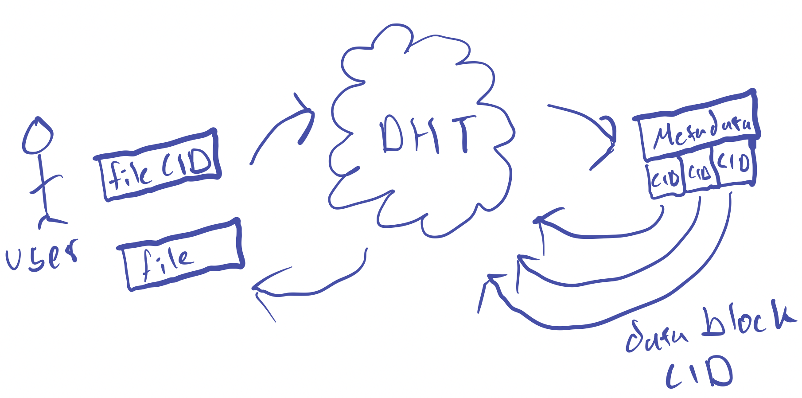

# IPFSish project 

Implementing a distributed file system like IPFS using rust and libp2p to learn more about how to actually build peer to peer networks.



If you are looking through project and see something you would do differently or things I could to keep building on this project please make a github issue so I can keep learning!

# Project Structure

The project is organized into several crates, each focusing on a specific aspect of the file system:

## dfs_storage
the `dfs_storage` crate handles the actual storage of data, such as writing to and reading from the disk. This crate manages data persistence, caching, and other low-level storage operations.

The three structs are `FileMetadata`, `DirectoryMetadata`, and `DataBlock`. All structs have a `cid` generated from the data block's content using the SHA2-256 hash function to be used in content based addressing.


### Node Hierarchy and Relationships
- `DirectoryMetadata` nodes represent directories in the file system. They can have both `FileMetadata` and `DirectoryMetadata` structs as children.
- `FileMetadata` nodes represent files in the file system. They can only have `DataBlock` structs as children. Each `DataBlock` child represents a portion of the file's content. The file's content can be reconstructed by concatenating the data from all of its associated `DataBlock` nodes in the correct order.
- `DataBlock` nodes represent individual data blocks in the file system. They cannot have any children. `DataBlock`vnodes are the lowest level in the hierarchy and only store actual data bytes.

## dfs_api

The `dfs_api` crate provides a high-level API for interacting with the file system, allowing users or other applications to perform operations like creating files, reading files, and listing directories. This API is built on top of the `dfs_storage` crate, which handles low-level storage operations.

This crate defines three primary structs for representing the file system: `Directory`, `File`, and `DataBlock`. Each struct has an associated `CID` (Content Identifier), which is generated using the SHA2-256 hash function for content-based addressing.

### High-level API

The `dfs_api` crate offers a simple and intuitive interface for performing common file system operations using CID for the file or directory The main functionality includes:

- Creating a new directory and return the CID `Directory::new_directory`
- Creating a new file and return the CID with `File::new_file` 
- Reading a file's content using its CID: `DFSApi::read_file`
- Listing files and directories in a given directory using its CID: `DFSApi::list_directory`
- Writing data to a file using its CID: `DFSApi::write_file`
- Deleting a file using its parent directory's CID: `DFSApi::delete_file`
- Deleting a directory using its parent directory's CID: `DFSApi::delete_directory`


The API also takes care of serialization and deserialization of the structs using the `bincode` library. This ensures that the data can be easily converted to and from binary format, allowing efficient storage and retrieval.


- `dfs_network`: Manages the networking aspect of the file system, using libp2p for peer discovery, connection establishment, and data exchange between peers.
## Getting Started

To build the project, ensure you have Rust and Cargo installed on your system. Then, navigate to the root directory of the workspace and run the following command:

```sh
cargo build